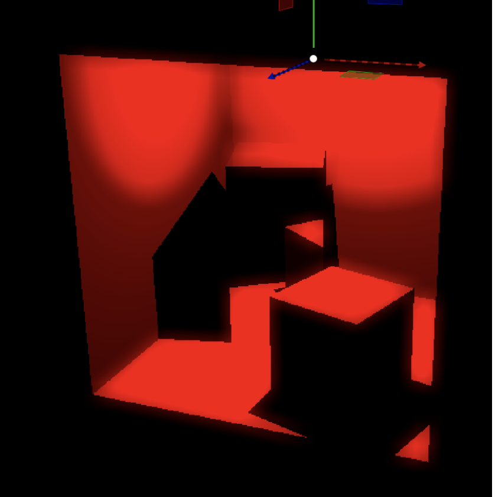
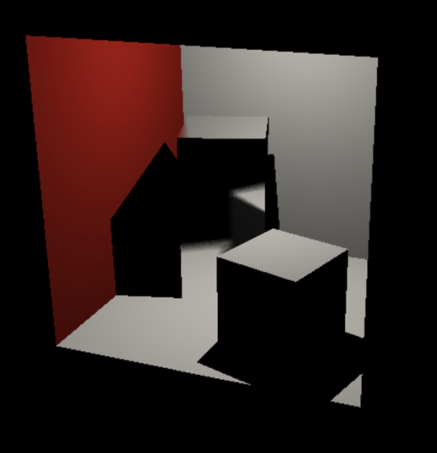
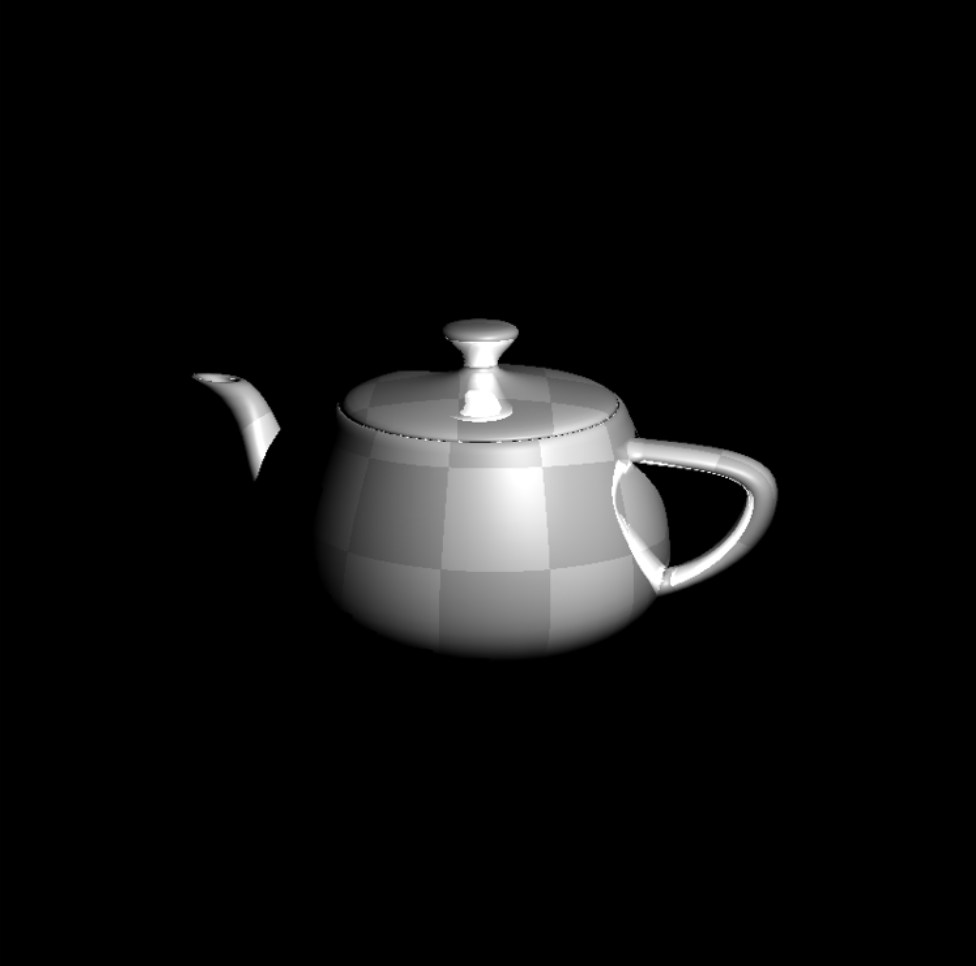
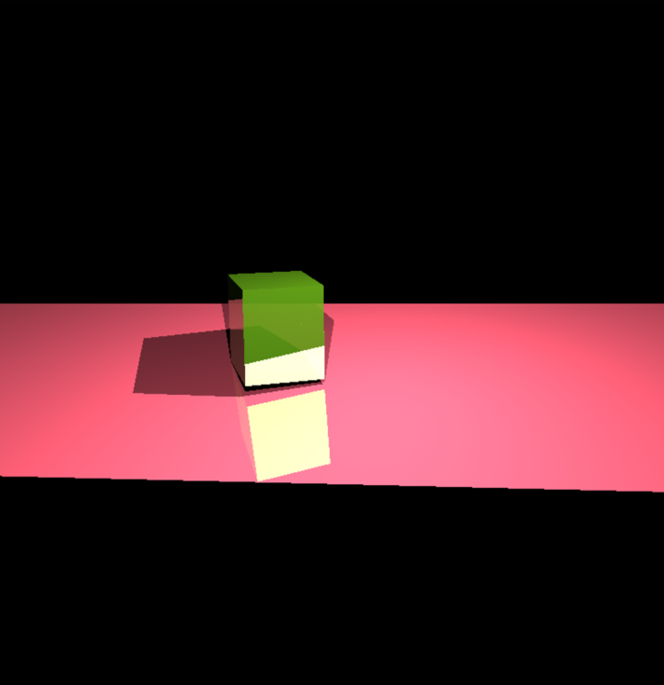

# Quick Intro
This project involves the development of a robust and feature-rich 3D ray tracer using the C++ programming language. The primary focus of this endeavor is to enable the rendering of intricate 3-dimensional meshes with exceptional visual fidelity and realism. The ray tracer encompasses a range of sophisticated features and functionalities that collectively contribute to its full functionality: 
- Shading using Phong Illumination Model
- Recursive ray-tracer (reflection ray, shadow rays)
- Hard shadows
- Area lights
- Acceleration data-structure generation
- Acceleration data-structure traversal
- Normal interpolation with barycentric coordinates
- Texture mapping
- SAH + binning as splitting criterion for BVH	
- Motion blur
- Bloom filter on the final image
- Cast multiple rays per pixel with irregular sampling	
- Glossy reflections	
- Transparency
- Depth of field

The user interface enables you to choose from a selection of test scenes to work with, including a custom scene. It initially loads a scene custom.obj in the data folder. If you like to load your own scene, you can simply overwrite the corresponding custom.obj with your own scene (please note that you should not rename your obj material file (MTL), as the original filename is mentioned within the obj file itself).

# Demo

    
    
    

    <em>Bloom Effect</em> | <em>Glossy Reflection</em> | <em>Motion Blur</em>

    
    

    <em>Texture Mapping</em> | <em>Transparency</em> 

# Performance 
|           | Cornell Box | Monkey     | Dragon    | Teapot    |
|-----------|-------------|------------|-----------|-----------|
| Num Triangles | 32       | 968        | 87K       | 15K       |
| Time      | 216.587 ms  | 268.021 ms | 345.016 ms| 4731.47 ms|
| BVH Levels| 6           | 11         | 18        | 15        |
| Max tris per leaf node | 1 | 1        | 1         | 1         |
| Time SAH  | 143.387 ms  | 196.058 ms | 231.279 ms| 4654.71 ms|
| BVH Levels| 8           | 16         | 24        | 19        |
| Max tris per leaf node | 1 | 1        | 1         | 1         |
---
Tested in Virtualbox with Macbook Pro 16 (6-Core, i7-9750H).

# Compilation
For a start, you can compile the code and test the application. Note that you can compile the code in two different modes “Debug” or “Release”. When compiled in “Debug” mode, there are a lot of additional tests that are done behind the scenes, e.g., if you are accessing a std::vector, it always checks that you stay within its bounds. It is very useful to compile in “Debug” mode when developing code to ensure that all these tests are performed. Nevertheless, once the code is working, you should switch to “Release”. If you now compile the code, it will be highly optimized and result in a tremendous speedup. Especially, when working with complicated scenes, it is a good idea to rely on “Release” mode. In the same spirit, when in “Debug” mode, you should rather work with simpler scenes to avoid long wait times.

# Authors
Tan M. Nguyen | Salzmann Linus | Aratrika Das